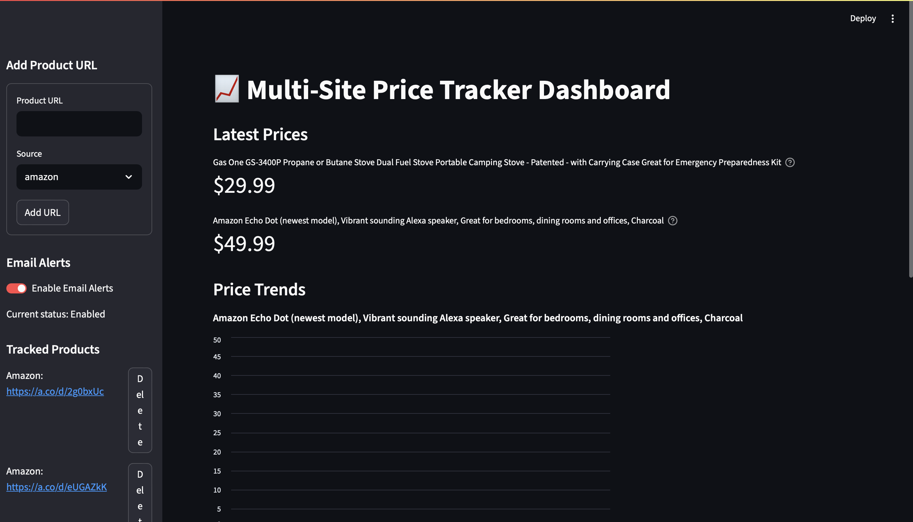

# 📈 PricePilot - Multi-Site Price Tracker Dashboard

PricePilot is a Python-based web scraper and real-time price tracker for products across e-commerce platforms like Amazon. It includes a beautiful interactive dashboard to monitor price trends and receive email alerts when prices drop.

## 🚀 Features

- ✅ Multi-product tracking
- 🌐 Powered by [Playwright](https://playwright.dev/python/)
- 📊 Real-time Streamlit dashboard
- 📩 Email alerts on price drops
- 🔎 Smart fallback scraping logic
- 📦 SQLite database for persistence

## 🛠️ Tech Stack

- Python 3.10+
- Playwright (async)
- Streamlit
- SQLite
- smtplib (for sending emails)

## 📸 Demo



## 📂 Project Structure

```
PricePilot/
├── sites/                  # Site-specific scrapers (e.g., amazon.py)
├── scraper.py              # Main async scraper
├── dashboard.py            # Streamlit UI
├── db_utils.py             # SQLite helpers
├── email_utils.py          # Email alerting
├── requirements.txt
├── .env.sample             # Sample environment config
└── README.md
```

## ⚙️ Setup Instructions

1. **Install dependencies**
   ```bash
   pip install -r requirements.txt
   playwright install
   ```

2. **Set environment variables**
   Copy `.env.sample` to `.env` and fill in your email credentials.

3. **Run the scraper**
   ```bash
   python scraper.py
   ```

4. **Launch the dashboard**
   ```bash
   streamlit run dashboard.py
   ```

## ✉️ Email Alerts

The app can send you an email alert whenever a price drops. Just enable the toggle in the dashboard and set your email settings in `.env`.

## 📜 License

This project is licensed under the MIT License.